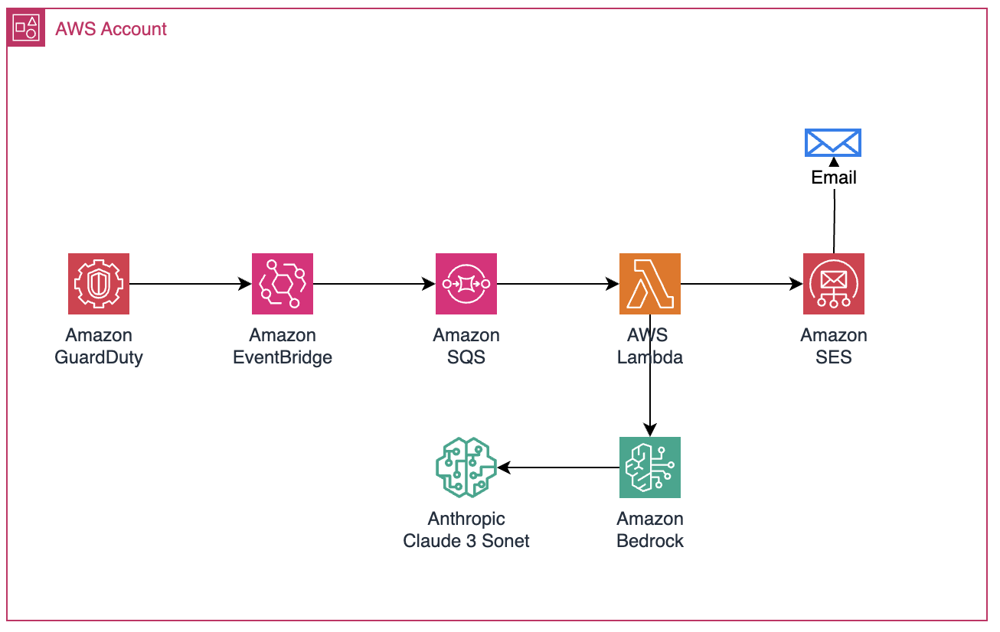

# AWS GuardDuty Findings Analyzer with SES

A comprehensive security monitoring solution that automatically analyzes AWS GuardDuty findings using Amazon Bedrock's Claude 3 Sonnet model and delivers detailed security alerts via Amazon SES.

## Overview

This project streamlines security monitoring by processing GuardDuty findings through AI analysis and delivering formatted reports containing:
- Severity assessment
- Finding details
- Resource information
- Network analysis
- AI-generated insights and recommendations

## Features

- Automated GuardDuty findings processing
- AI-powered analysis using Amazon Bedrock
- Formatted email alerts via Amazon SES
- Detailed resource and network information
- Severity-based categorization
- Region-specific monitoring

## Prerequisites

- AWS Account
- GuardDuty enabled
- Amazon Bedrock access
- Configured Amazon SES
- IAM permissions for Lambda execution

## Architecture

**AWS Services Used:**
- AWS GuardDuty: Threat detection
- Amazon Bedrock: AI analysis
- Amazon SES: Email delivery
- AWS Lambda: Processing
- Amazon EventBridge: Event routing



## Deployment

1. Clone the repository
```bash
git https://github.com/aws-samples/analyze-aws-guardduty-findings-with-bedrock
cd analyze-aws-guardduty-findings-with-bedrock
```

2. Deploy using CloudFormation
```bash
aws cloudformation deploy \
  --template-file template.yaml \
  --stack-name guardduty-analyzer \
  --parameter-overrides \
    SenderEmail=your-verified@email.com \
    RecipientEmail=security-team@company.com
```

## Configuration

Update the CloudFormation parameters:
- SenderEmail: Verified SES email address
- RecipientEmail: Security team email address

## IAM Permissions

The solution creates:
- Lambda execution role
- Permissions for GuardDuty access
- SES sending privileges
- Bedrock model invocation rights

## Contributing

1. Fork the repository
2. Create a feature branch
3. Commit your changes
4. Push to the branch
5. Open a Pull Request

## License

This project is licensed under the MIT-0 License.
<<<<<<< HEAD
```
=======
```


>>>>>>> 2894b67 (Done changes to readme file)
